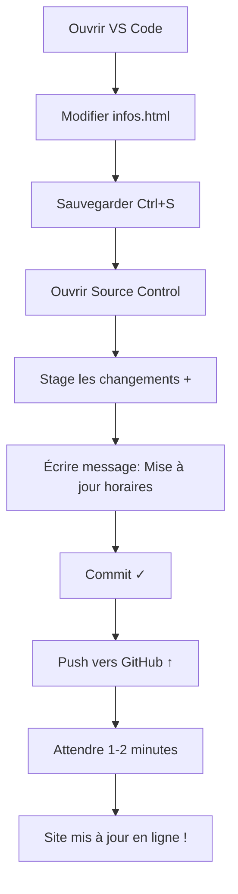

# Guide : Déployer et Mettre à Jour votre Site LORC avec Git, VS Code et GitHub

## 📋 Vue d'ensemble

Ce guide vous explique comment utiliser **Visual Studio Code** (VS Code) pour mettre à jour votre site web LORC et le publier sur **GitHub**, puis le déployer gratuitement avec **GitHub Pages**.

### Ce que vous allez apprendre
- ✅ Utiliser l'interface Git intégrée dans VS Code
- ✅ Faire des commits (sauvegardes) de vos modifications
- ✅ Pousser (push) vos changements vers GitHub
- ✅ Activer GitHub Pages pour rendre votre site accessible
- ✅ Mettre à jour votre site en ligne à chaque modification

---

## 🎯 Workflow de mise à jour du site


---

## 🚀 Partie 1 : Configuration initiale (à faire une seule fois)

### Étape 1 : Vérifier que Git est configuré

Ouvrez le terminal intégré dans VS Code :
- **Menu** : `Terminal` > `New Terminal`
- **Raccourci** : `Ctrl + ù` (Windows/Linux) ou `Cmd + ù` (Mac)

Tapez ces commandes pour configurer votre identité Git :

```bash
# Configurer votre nom (remplacez par votre nom)
git config --global user.name "Votre Nom"

# Configurer votre email (utilisez l'email de votre compte GitHub)
git config --global user.email "votre.email@example.com"

# Vérifier la configuration
git config --list
```

### Étape 2 : Vérifier la connexion avec GitHub

Dans le terminal, vérifiez que votre projet est bien lié à GitHub :

```bash
git remote -v
```

Vous devriez voir quelque chose comme :
```
origin  https://github.com/VOTRE-USERNAME/VOTRE-REPO.git (fetch)
origin  https://github.com/VOTRE-USERNAME/VOTRE-REPO.git (push)
```

**Si vous ne voyez rien**, cela signifie que vous devez lier votre projet à GitHub :

```bash
# Remplacez USERNAME et REPO par vos informations
git remote add origin https://github.com/USERNAME/REPO.git
```

### Étape 3 : Créer un fichier .gitignore

Ce fichier indique à Git quels fichiers ignorer. Créez un fichier nommé `.gitignore` à la racine de votre projet avec ce contenu :

```
# Fichiers système macOS
.DS_Store
.AppleDouble
.LSOverride

# Fichiers système Windows
Thumbs.db
Desktop.ini

# Fichiers VS Code
.vscode/
*.code-workspace

# Fichiers temporaires
*.tmp
*.log
*~

# Fichiers à ne pas versionner
fichier 2
```

---

## 💻 Partie 2 : Utiliser Git depuis VS Code (interface graphique)

VS Code a une interface Git intégrée très pratique. Voici comment l'utiliser :

### Vue d'ensemble de l'interface Git dans VS Code

1. **Icône Source Control** : Dans la barre latérale gauche, cliquez sur l'icône qui ressemble à une branche (3ème icône)
2. **Panneau Source Control** : Affiche tous vos changements
3. **Fichiers modifiés** : Liste des fichiers que vous avez modifiés

### Workflow complet avec l'interface VS Code

#### Étape 1 : Modifier vos fichiers
- Ouvrez et modifiez vos fichiers HTML/CSS dans VS Code
- Sauvegardez vos modifications (`Ctrl+S` ou `Cmd+S`)

#### Étape 2 : Voir vos changements
1. Cliquez sur l'icône **Source Control** (barre latérale gauche)
2. Vous verrez la liste des fichiers modifiés avec :
   - **M** = Modified (modifié)
   - **A** = Added (ajouté)
   - **D** = Deleted (supprimé)
   - **U** = Untracked (nouveau fichier non suivi)

#### Étape 3 : Stage (préparer) vos changements
Vous avez deux options :

**Option A : Stage tous les fichiers**
- Cliquez sur le **+** à côté de "Changes" pour tout ajouter

**Option B : Stage des fichiers spécifiques**
- Survolez un fichier et cliquez sur le **+** à côté du nom du fichier

Les fichiers "staged" apparaissent dans la section "Staged Changes"

#### Étape 4 : Commit (sauvegarder) vos changements
1. Dans la zone de texte en haut (où il est écrit "Message"), tapez un message décrivant vos modifications :
   - Exemples de bons messages :
     - `Mise à jour des horaires d'entraînement`
     - `Ajout des photos de l'équipe`
     - `Correction des fautes d'orthographe`
     - `Modification des couleurs du header`

2. Cliquez sur le bouton **✓ Commit** (ou `Ctrl+Enter`)

#### Étape 5 : Push (envoyer) vers GitHub
1. Après le commit, cliquez sur le bouton **⋯** (trois points) en haut du panneau Source Control
2. Sélectionnez **Push** dans le menu
3. Ou utilisez le bouton **↑** (flèche vers le haut) qui apparaît après un commit

**Première fois** : VS Code vous demandera peut-être de vous connecter à GitHub
- Cliquez sur "Sign in with GitHub"
- Autorisez VS Code dans votre navigateur
- Revenez à VS Code

#### Étape 6 : Vérifier sur GitHub
1. Allez sur votre repository GitHub dans votre navigateur
2. Actualisez la page
3. Vous devriez voir vos nouveaux fichiers et votre message de commit

---

## 🖥️ Partie 3 : Utiliser Git depuis le Terminal (méthode alternative)

Si vous préférez utiliser le terminal, voici les commandes :

### Workflow complet en ligne de commande

```bash
# 1. Voir l'état de vos fichiers
git status

# 2. Ajouter tous les fichiers modifiés
git add .

# OU ajouter des fichiers spécifiques
git add index.html style.css

# 3. Créer un commit avec un message
git commit -m "Votre message de commit"

# 4. Pousser vers GitHub
git push origin main

# Si c'est votre premier push, utilisez :
git push -u origin main
```

### Commandes Git utiles

```bash
# Voir l'historique des commits
git log

# Voir l'historique simplifié
git log --oneline

# Voir les différences avant de commit
git diff

# Voir les différences d'un fichier spécifique
git diff index.html

# Annuler les modifications d'un fichier (avant commit)
git checkout -- index.html

# Voir les branches
git branch

# Créer une nouvelle branche
git branch nom-de-la-branche

# Changer de branche
git checkout nom-de-la-branche

# Créer et changer de branche en une commande
git checkout -b nom-de-la-branche
```

---

## 🌐 Partie 4 : Activer GitHub Pages

Une fois votre code sur GitHub, activez GitHub Pages pour rendre votre site accessible :

### Méthode 1 : Via l'interface GitHub

1. **Aller sur votre repository GitHub**
   - Ouvrez votre navigateur
   - Allez sur `https://github.com/VOTRE-USERNAME/VOTRE-REPO`

2. **Accéder aux paramètres**
   - Cliquez sur l'onglet **Settings** (en haut à droite)

3. **Configurer GitHub Pages**
   - Dans le menu de gauche, cliquez sur **Pages**
   - Sous "Source", sélectionnez :
     - **Branch** : `main` (ou `master` selon votre configuration)
     - **Folder** : `/ (root)`
   - Cliquez sur **Save**

4. **Attendre le déploiement**
   - GitHub affichera un message : "Your site is ready to be published at..."
   - Attendez 1-2 minutes
   - Actualisez la page
   - Vous verrez : "Your site is published at https://USERNAME.github.io/REPO/"

5. **Accéder à votre site**
   - Cliquez sur le lien ou copiez-le dans votre navigateur
   - Votre site est maintenant en ligne ! 🎉

### Méthode 2 : Créer un fichier de configuration

Vous pouvez aussi créer un fichier `.github/workflows/pages.yml` pour automatiser le déploiement, mais la méthode 1 est plus simple pour commencer.

---

## 🔄 Partie 5 : Workflow quotidien de mise à jour

Voici le processus à suivre chaque fois que vous voulez mettre à jour votre site :

### Scénario : Vous voulez modifier les horaires d'entraînement



### Étapes détaillées

1. **Modifier vos fichiers**
   ```
   - Ouvrez le fichier à modifier (ex: infos.html)
   - Faites vos modifications
   - Sauvegardez (Ctrl+S)
   ```

2. **Dans VS Code - Source Control**
   ```
   - Cliquez sur l'icône Source Control
   - Vérifiez les fichiers modifiés
   - Cliquez sur + pour stage
   ```

3. **Commit**
   ```
   - Tapez un message clair
   - Cliquez sur ✓ Commit
   ```

4. **Push**
   ```
   - Cliquez sur ⋯ > Push
   - Ou cliquez sur la flèche ↑
   ```

5. **Vérifier**
   ```
   - Allez sur GitHub (navigateur)
   - Vérifiez que votre commit apparaît
   - Attendez 1-2 minutes
   - Actualisez votre site web
   - Videz le cache si nécessaire (Ctrl+F5)
   ```

---

## 📝 Bonnes pratiques Git

### Messages de commit

**✅ Bons messages** (clairs et descriptifs)
```
Ajout de la page contact
Mise à jour des tarifs 2025
Correction faute d'orthographe dans club.html
Modification des couleurs du header
Ajout des photos de l'équipe seniors
```

**❌ Mauvais messages** (trop vagues)
```
update
fix
changes
test
aaa
```

### Fréquence des commits

- **Commit souvent** : Faites un commit après chaque modification logique
- **Ne pas attendre** : Ne faites pas un gros commit avec 50 fichiers modifiés
- **Commits atomiques** : Un commit = une fonctionnalité ou une correction

### Organisation des branches

Pour commencer, travaillez sur la branche `main`. Plus tard, vous pourrez créer des branches pour :
- Tester de nouvelles fonctionnalités
- Travailler sur des modifications importantes
- Collaborer avec d'autres personnes

---

## 🎨 Partie 6 : Personnalisation avancée

### Ajouter un nom de domaine personnalisé

Au lieu de `username.github.io/repo`, vous pouvez avoir `www.lorc-rugby.fr` :

1. **Acheter un nom de domaine**
   - Chez OVH, Gandi, Namecheap, etc.
   - Coût : environ 10-15€/an

2. **Configurer dans GitHub**
   - Settings > Pages > Custom domain
   - Entrez votre nom de domaine
   - Cliquez sur Save

3. **Configurer les DNS**
   - Chez votre registrar (OVH, Gandi, etc.)
   - Ajoutez un enregistrement CNAME :
     ```
     Type: CNAME
     Nom: www
     Valeur: USERNAME.github.io
     ```
   - Ou des enregistrements A pour le domaine racine :
     ```
     Type: A
     Nom: @
     Valeur: 185.199.108.153
     Valeur: 185.199.109.153
     Valeur: 185.199.110.153
     Valeur: 185.199.111.153
     ```

4. **Attendre la propagation DNS**
   - Peut prendre de 1 heure à 48 heures
   - Vérifiez avec : `nslookup votre-domaine.fr`

### Activer HTTPS

GitHub Pages active automatiquement HTTPS pour votre site :
- Cochez "Enforce HTTPS" dans Settings > Pages
- Attendez quelques minutes
- Votre site sera accessible en `https://`

---

## 🔧 Partie 7 : Dépannage

### Problème 1 : "Permission denied" lors du push

**Cause** : Problème d'authentification avec GitHub

**Solution** :
```bash
# Utiliser HTTPS avec token
git remote set-url origin https://github.com/USERNAME/REPO.git

# Ou configurer SSH (plus avancé)
# Suivre le guide : https://docs.github.com/en/authentication/connecting-to-github-with-ssh
```

### Problème 2 : "Your branch is behind 'origin/main'"

**Cause** : Quelqu'un d'autre a poussé des changements, ou vous avez modifié directement sur GitHub

**Solution** :
```bash
# Récupérer les derniers changements
git pull origin main

# Puis faire votre push
git push origin main
```

### Problème 3 : Conflit de fusion (merge conflict)

**Cause** : Deux personnes ont modifié le même fichier

**Solution** :
1. Git vous indiquera les fichiers en conflit
2. Ouvrez ces fichiers dans VS Code
3. Vous verrez des marqueurs comme :
   ```
   <<<<<<< HEAD
   Votre version
   =======
   Version de GitHub
   >>>>>>> origin/main
   ```
4. Choisissez quelle version garder
5. Supprimez les marqueurs
6. Sauvegardez, commit et push

### Problème 4 : Le site ne se met pas à jour

**Solutions** :
1. **Vider le cache du navigateur**
   - Chrome/Edge : `Ctrl + Shift + R` (Windows) ou `Cmd + Shift + R` (Mac)
   - Firefox : `Ctrl + F5` (Windows) ou `Cmd + Shift + R` (Mac)

2. **Vérifier le statut du déploiement**
   - Allez sur votre repo GitHub
   - Cliquez sur l'onglet "Actions"
   - Vérifiez que le déploiement est terminé (coche verte)

3. **Attendre**
   - GitHub Pages peut prendre 1-5 minutes pour se mettre à jour

### Problème 5 : "fatal: not a git repository"

**Cause** : Vous n'êtes pas dans le bon dossier

**Solution** :
```bash
# Vérifier où vous êtes
pwd

# Naviguer vers votre projet
cd /Users/b.prevost/Desktop/test\ versionning

# Vérifier que c'est un repo Git
ls -la | grep .git
```

### Problème 6 : Fichiers non suivis (untracked)

**Cause** : Nouveaux fichiers que Git ne connaît pas encore

**Solution** :
```bash
# Voir les fichiers non suivis
git status

# Ajouter tous les nouveaux fichiers
git add .

# Ou ajouter un fichier spécifique
git add nouveau-fichier.html
```

---

## 📊 Partie 8 : Visualiser l'historique Git

### Dans VS Code

1. **Installer l'extension Git Graph**
   - Ouvrez Extensions (Ctrl+Shift+X)
   - Cherchez "Git Graph"
   - Installez l'extension

2. **Utiliser Git Graph**
   - Cliquez sur "Git Graph" en bas de VS Code
   - Vous verrez un graphique de tous vos commits
   - Cliquez sur un commit pour voir les détails

### Dans le terminal

```bash
# Historique complet
git log

# Historique simplifié
git log --oneline

# Historique avec graphique
git log --oneline --graph --all

# Voir les changements d'un commit spécifique
git show COMMIT_HASH
```

---

## 🎯 Partie 9 : Checklist de déploiement

### Avant de push

- [ ] J'ai testé mes modifications localement
- [ ] Tous les liens fonctionnent
- [ ] Le CSS s'applique correctement
- [ ] Pas d'erreurs dans la console du navigateur
- [ ] Les fichiers sont sauvegardés
- [ ] J'ai écrit un message de commit clair

### Après le push

- [ ] Le push a réussi (pas d'erreur)
- [ ] Les changements apparaissent sur GitHub
- [ ] J'ai attendu 1-2 minutes
- [ ] Le site en ligne est mis à jour
- [ ] J'ai vidé le cache du navigateur
- [ ] Tout fonctionne correctement en ligne

---

## 📚 Ressources utiles

### Documentation officielle
- [Git Documentation](https://git-scm.com/doc)
- [GitHub Docs](https://docs.github.com/)
- [VS Code Git Support](https://code.visualstudio.com/docs/sourcecontrol/overview)
- [GitHub Pages](https://docs.github.com/en/pages)

### Tutoriels en français
- [OpenClassrooms - Git et GitHub](https://openclassrooms.com/fr/courses/7162856-gerez-du-code-avec-git-et-github)
- [Grafikart - Git](https://grafikart.fr/formations/git)

### Aide-mémoire Git (Cheat Sheet)

```bash
# Configuration
git config --global user.name "Nom"
git config --global user.email "email@example.com"

# Commandes de base
git status                    # Voir l'état
git add .                     # Ajouter tous les fichiers
git add fichier.html          # Ajouter un fichier spécifique
git commit -m "Message"       # Créer un commit
git push origin main          # Pousser vers GitHub
git pull origin main          # Récupérer depuis GitHub

# Voir l'historique
git log                       # Historique complet
git log --oneline             # Historique simplifié

# Annuler des changements
git checkout -- fichier.html  # Annuler modifications (avant add)
git reset HEAD fichier.html   # Unstage un fichier
git revert COMMIT_HASH        # Annuler un commit

# Branches
git branch                    # Lister les branches
git branch nom-branche        # Créer une branche
git checkout nom-branche      # Changer de branche
git checkout -b nom-branche   # Créer et changer de branche
git merge nom-branche         # Fusionner une branche

# Remote
git remote -v                 # Voir les remotes
git remote add origin URL     # Ajouter un remote
```

---

## 🎓 Exercice pratique

Pour vous entraîner, suivez cet exercice :

### Exercice : Modifier et déployer une page

1. **Modifier la page d'accueil**
   - Ouvrez [`index.html`](../index.html)
   - Changez le texte de bienvenue
   - Sauvegardez

2. **Commit avec VS Code**
   - Ouvrez Source Control
   - Stage le fichier
   - Message : "Modification du texte de bienvenue"
   - Commit

3. **Push vers GitHub**
   - Cliquez sur Push
   - Vérifiez sur GitHub

4. **Vérifier le site en ligne**
   - Attendez 1-2 minutes
   - Actualisez votre site
   - Vérifiez que le changement est visible

5. **Annuler le changement (pour pratiquer)**
   ```bash
   git revert HEAD
   git push origin main
   ```

---

## ✅ Résumé du workflow

### Version courte (à mémoriser)

1. **Modifier** vos fichiers dans VS Code
2. **Sauvegarder** (Ctrl+S)
3. **Source Control** > Stage (+)
4. **Message** de commit
5. **Commit** (✓)
6. **Push** (↑)
7. **Attendre** 1-2 minutes
8. **Vérifier** le site en ligne

### Commandes terminal (alternative)

```bash
git add .
git commit -m "Votre message"
git push origin main
```

---

## 🎉 Félicitations !

Vous savez maintenant comment :
- ✅ Utiliser Git depuis VS Code
- ✅ Faire des commits de vos modifications
- ✅ Pousser vers GitHub
- ✅ Déployer votre site avec GitHub Pages
- ✅ Mettre à jour votre site en ligne

Votre site LORC est maintenant professionnel, versionné et facilement maintenable !

---

## 📞 Prochaines étapes

Maintenant que vous maîtrisez le workflow Git, vous pouvez :

1. **Améliorer votre site**
   - Ajouter des images
   - Créer un formulaire de contact
   - Ajouter Google Analytics
   - Optimiser pour le SEO

2. **Apprendre plus sur Git**
   - Utiliser les branches pour tester des fonctionnalités
   - Collaborer avec d'autres personnes
   - Utiliser Git pour d'autres projets

3. **Automatiser davantage**
   - Configurer des GitHub Actions
   - Ajouter des tests automatiques
   - Optimiser le déploiement

N'hésitez pas à poser des questions si vous rencontrez des difficultés !
